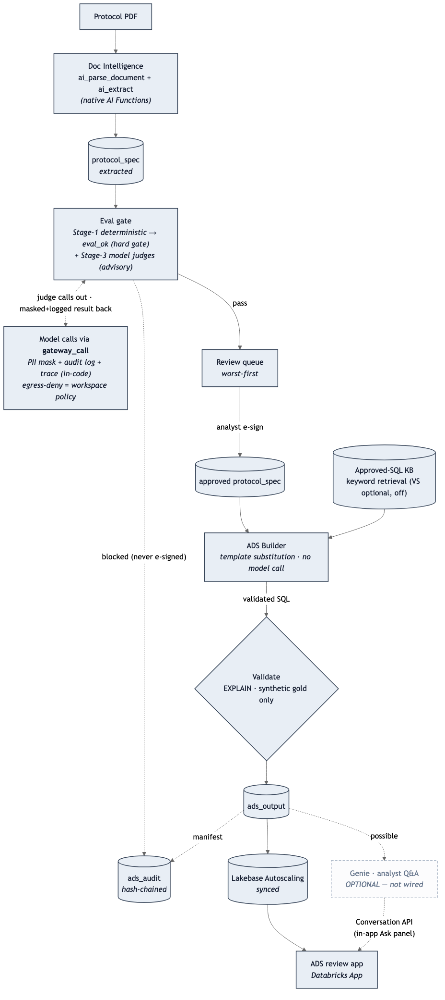

# RWE Analysis-Ready Dataset (ADS) Automation

Turn a **study protocol** into an **analysis-ready dataset (ADS)** over synthetic
real-world data (RWD) by generating **validated SQL** from an **approved-SQL
knowledge base**, with a mandatory analyst-review gate, full reproducibility/audit,
and PHI-containment controls — served low-latency from **Lakebase**.

- **Persona:** MD Epidemiology / Real-World Data Science (Epi-RWDS)
- **Runs over synthetic RWD** — migrate to your production workspace by copying `demo.config.example.yaml` → `demo.config.yaml` (gitignored) and editing it.
- **Independent** of the DS Evidence Copilot (own repo, own `ads_*` schemas, own app).

> **Migrate to another workspace** by copying **`demo.config.example.yaml`** → **`demo.config.yaml`** (gitignored) and editing it (catalog, schemas,
> Lakebase, warehouse) and a bundle target — nothing else hardcodes those names.

## Architecture (waves)

| Wave | What | Key resources |
|------|------|---------------|
| 0 | Foundation (serverless) | 5 `ads_*` schemas, `protocols` volume, approved-SQL KB, in-process model gateway (`gateway_call` in-code: PII mask + audit log + MLflow trace; egress-deny is a **workspace policy** (`egress_policy: deny_external`), not enforced inside `gateway_call`; native `ads-ai-gateway` endpoint is a pattern placeholder). *(Lakebase DBs are provisioned control-plane by `setup_lakebase.sh`, not in this wave.)* |
| 1 | Synthetic RWD + Bronze + Protocol ingest | deterministic seeded generators (`lib/synth`), bronze in `ads_raw`, Document-Intelligence protocol spec |
| 2 | Medallion Silver + Gold (SDP) | conformed RWD CDM (`ads_curated`) + analytic base (`ads_serving`: `patient_timeline`, `code_rollups`, `eligibility_periods`) |
| 3 | ADS builder + eval + review gate | approved-SQL KB (keyword retrieval; VS optional, off), ordered cohort→incl/excl→derivation→assembly via **template substitution (no model call)**, **validate-don't-execute** (EXPLAIN); **extraction eval** — Stage-1 deterministic validators are the **hard gate** (`eval_ok` blocks e-sign), Stage-2 confidence, Stage-3 model judges (via `gateway_call`) are **advisory** (they set review priority + flags, not `eval_ok`, and degrade to Stage-1/2 when no endpoint/source text) → worst-first review queue; analyst e-sign (demo default `allow_auto_esign: true` auto-signs eval-passing specs under a SYSTEM actor — set `false` for the human analyst e-sign) |
| 4 | Model benchmark + cost (optional) | multi-model benchmark over candidate LLMs, MLflow 3.x eval (SQL validity, grounding, faithfulness), cost attribution |
| 5 | Serving + Audit + WI + App | hash-chained reproducibility manifest + GxP audit (serverless), Validated Work Instruction, the `<initials>-rwe-ads-app` app. *(Lakebase synced tables (Delta→PG, one-way) + app-SP grant are provisioned control-plane by `setup_synced_tables.sh`.)* |

<p align="center">
  
</p>

<sub>Architecture: Protocol PDF → extract → Stage-1 deterministic → `eval_ok` (hard gate) + Stage-3 model judges (advisory) → analyst review/e-sign → deterministic ADS build (template substitution) → EXPLAIN → `ads_output` → audit / Lakebase serving / (optional) Genie. Solid = wired; dashed = optional/not-wired.</sub>

> **KB retrieval uses keyword matching by default.** Vector Search is **optional and off by default**:
> set `vector_search.enabled: true` in the config and create (or point `approved_sql_kb.vs_endpoint` at)
> an `ads-vs-endpoint` Vector Search endpoint to activate. `waves/wave0_foundation/build_index.py` (the
> `build_kb_index` task, in **Wave 0** — foundation infra) then builds a TRIGGERED delta-sync index
> (`databricks-gte-large-en` over `description`, pk `snippet_id`).
> While disabled, `build_kb_index` is a clean no-op (`status: disabled`) and `kb_retrieval.py` uses
> keyword match — so the pipeline works without a Vector Search endpoint. (Creating an endpoint is a
> billable operator step, so it is never auto-provisioned.)

## Golden rules
Serverless only · **no `w.postgres` in any serverless wave** (Lakebase infra is
control-plane, see Deploy) · no `CREATE CATALOG` · Lakebase provisioning is a
control-plane run-once step (`setup_lakebase.sh`) · idempotent DDL · MLflow 3.x · apps bind
`$DATABRICKS_APP_PORT` · single source of truth `demo.config.yaml` ·
**validate-don't-execute** (the builder runs only against synthetic gold; no real
patient DB exists by construction) · PHI containment via in-process `gateway_call` (PII mask + audit + trace; egress-deny is a workspace policy) · reproducible by
construction · human-in-the-loop review (mandatory for regulated use; the demo ships `allow_auto_esign: true`, which auto-signs eval-passing specs under a SYSTEM actor until set `false`).

## Configure (do this FIRST)

The bundle hardcodes **no** catalog / schema / warehouse — you point it at your own via one gitignored file.

**Prereqs the bundle never creates:** a UC **catalog** that already exists (never `CREATE CATALOG`), a serverless **SQL warehouse**, and your CLI profile (`databricks auth login --profile <PROFILE>`).

1. **Copy the template and fill in your values** (this file holds real values and is **gitignored** — never committed):
   ```bash
   cp demo.config.example.yaml demo.config.yaml
   ```
   Set: `workspace.host`, `workspace.warehouse_id`, `catalog`, the five `schemas.*`, and `lakebase.project`.

2. **Naming convention** — prefix every resource `<initials>-<proj>-<task>` so nothing collides on a shared workspace (e.g. `<initials>-rwe-ads-*`):

   | resource | form | example |
   |---|---|---|
   | UC schemas | underscores | `<initials>_rwe_ads_{raw,curated,serving,kb,audit}` |
   | Lakebase project | hyphens | `<initials>-rwe-ads-lakebase` |
   | App (`resources/app.yml` `name:`) | hyphens | `<initials>-rwe-ads-app` |

3. **Do NOT hand-edit `app/demo.config.yaml`** — it is a build artifact that `app/build.py` regenerates from your root `demo.config.yaml`. Your real values stay only in the gitignored root config.

> **Deploy-time `--var` flags (important).** Five bundle variables are resolved when `bundle deploy` runs and **cannot** read `demo.config.yaml`, so you must pass them explicitly (values must match your config). Skipping them is the #1 setup failure — the pipeline/app come up pointing at the placeholder `rwe_ads_catalog` and error. Set them once and reuse:
> ```bash
> VARS="--var uc_catalog=<your catalog> \
>       --var silver_schema=<your schemas.curated> \
>       --var warehouse_id=<your workspace.warehouse_id> \
>       --var lakebase_project=<your lakebase.project> \
>       --var notification_email=<your email>"
> ```
> Then append `$VARS` to **every** `bundle deploy` and `bundle run` command below.

## Deploy (Databricks Asset Bundle)

**Hands-off order.** All Lakebase infrastructure is provisioned **control-plane** (via the
`databricks postgres` / `databricks psql` CLI on your machine), NOT from a serverless wave —
because an in-kernel `w.postgres` SDK call hard-crashes the serverless job kernel (native,
verified). The serverless waves make **zero `w.postgres` calls**.

**Prereq (never created by the bundle):** the UC **catalog** (`demo.config.yaml` `catalog`)
must already exist. `setup_lakebase.sh` (step 1) creates the Lakebase Autoscaling **project**
(auto-provisioning its `production` branch, `primary` endpoint, and `databricks_postgres`
DB, so the app's `postgres` resource binds a DB that exists — no 404 on deploy) and the serving
+ app-state Postgres DBs. It does **not** register a UC catalog in the default path: the app
reads Lakebase Postgres directly, so serving needs no new catalog and no `CREATE CATALOG`.
(An optional opt-in step, `LAKEBASE_REGISTER_UC_CATALOG=1`, registers one for UC-governed access.)

```bash
# 1. control-plane Lakebase infra (project + ads_serving_pg + ads_app DBs). No CREATE CATALOG. Idempotent.
scripts/setup_lakebase.sh <PROFILE>                              # e.g. <your-profile>

# 2. deploy (jobs + pipeline + app; app binds databricks_postgres on the project)
databricks bundle validate -t dev --profile <PROFILE>
databricks bundle deploy   -t dev --profile <PROFILE> $VARS

# 3. run the serverless waves that produce gold (zero w.postgres)
databricks bundle run wave0_foundation       -t dev --profile <PROFILE> $VARS  # schemas/volume/KB/VS index/gateway
databricks bundle run wave1_synth_bronze     -t dev --profile <PROFILE> $VARS  # synth + medallion (silver+gold)
databricks bundle run wave3_ads_build        -t dev --profile <PROFILE> $VARS  # protocol eval + approve gate + ADS build -> gold ads_output/cohort_summary
databricks bundle run wave4_model_benchmark -t dev --profile <PROFILE> $VARS  # benchmark + cost (independent of serving)

# 4. control-plane serving sync + app-state DDL + app-SP grant (needs gold + the deployed app SP)
scripts/setup_synced_tables.sh <PROFILE>                         # create-synced-table (Delta->PG) + psql DDL/grants

# 5. audit (zero w.postgres; serving + grant already done control-plane in step 4)
databricks bundle run wave5_serving_audit    -t dev --profile <PROFILE> $VARS  # hash-chained repro_manifest + gxp_audit

# App: build frontend (see docs/RUNBOOK.md), then deploy + start it
databricks bundle run rwds_ads_studio -t dev --profile <PROFILE> $VARS   # app resource key -> deploys the app named in resources/app.yml
```

> **Lakebase = Autoscaling.** The retired Provisioned tier (`w.database` / `/api/2.0/database/*`)
> is gone. `setup_lakebase.sh` creates the `ads_serving_pg` (serving) + `ads_app` (app-state)
> Postgres DBs on the project's production branch (no UC catalog — the app reads Postgres
> directly); `setup_synced_tables.sh` syncs gold → serving Postgres `public.<table>` via
> `databricks postgres create-synced-table` (into the existing owned catalog, no `CREATE CATALOG`),
> creates the app-state tables, and grants the app SP (via `databricks psql`). The app reaches
> both DBs by dbname-override on the same primary endpoint (its `postgres` resource mints the
> Lakebase OAuth token in the app container — the documented Databricks-Apps pattern, not the
> crashing serverless kernel).

## Layout
```
demo.config.yaml            # SINGLE source of truth (gitignored; copy from .example)
demo.config.example.yaml    # tracked template — copy to demo.config.yaml + fill in
lib/config.py               # the only place names resolve
lib/synth/                  # deterministic seeded RWD generators
lib/pipeline/               # KB retrieval, token subst, validation, ADS builder, prompts
lib/phi.py                  # PHI masking helper
pipelines/                  # serverless SDP: bronze / silver / gold
waves/wave0..5/             # per-wave provisioning + logic
resources/*.yml             # DAB jobs / pipeline / app
app/                        # React 19 + Vite + Tailwind (frontend) + FastAPI (backend)
tests/                      # idempotency, PHI-mask, guardrail, validate-not-execute, audit
docs/                       # POC_SCOPE, ARCHITECTURE, RUNBOOK, VALIDATED_WORK_INSTRUCTION
```

See `docs/POC_SCOPE.md` for scope + success criteria and `docs/RUNBOOK.md` for
deployment and your production workspace migration.
